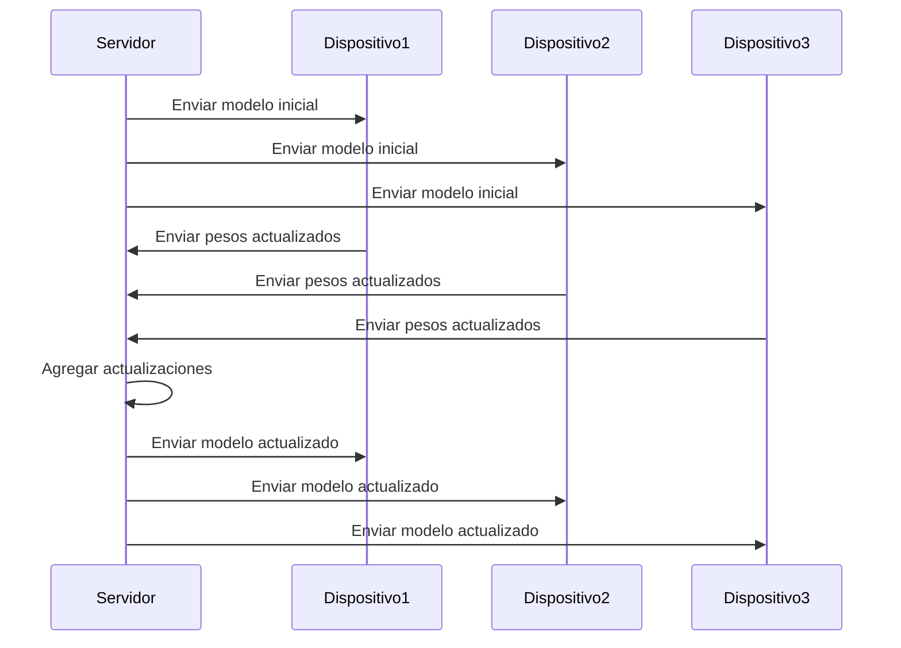

# Cómo funciona

El Aprendizaje Federado sigue un proceso iterativo que consta de los siguientes pasos:

1. **Inicialización:** Se distribuye un modelo inicial a los dispositivos.
2. **Entrenamiento local:** Cada dispositivo entrena el modelo con sus propios datos de manera local.
3. **Envío de actualizaciones:** En lugar de enviar los datos, los dispositivos envían solo los pesos y gradientes del modelo al servidor central.
4. **Agregación de actualizaciones:** El servidor central combina las actualizaciones y genera una nueva versión mejorada del modelo.
5. **Redistribución del modelo:** Se envía el modelo actualizado a los dispositivos y el ciclo se repite.

[Volver al índice](README.md)

